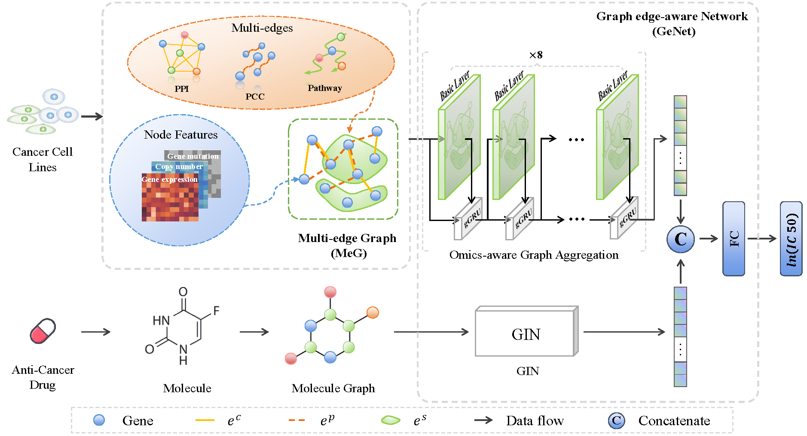

<!-- # Towards More Accurate Drug Response Predictionby Integrating Multi-omics Data of the Whole Genome -->

# PyTorch implementation for "Towards More Accurate Drug Response Predictionby Integrating Multi-omics Data of the Whole Genome" <br/>

Ruiwei Feng, Yufeng Xie

## Introduction

Accurately predicting drug response for each individual patient is a critical yet challenging task in precision medicine.We propose a novel Attention-Guided Multi-omics Integration (AGMI) approach for drug response prediction(DRP), which
explores a possibly well-suited multi-omics integration method with the whole genome.

  <br/>


## Results on benchmark dataset

We trained AGMI on our [benchmark dataset](https://drive.google.com/drive/folders/1bFQvfxYoj_RNYrnYcfnFRtNTgul5DmTO?usp=sharing), and evaluated its performances by Root Mean Square Error (RMSE), Mean Absolute Error (MAE), Mean SquareError (MSE), and R-squared (R2).

|     Method     |  RMSE  | MAE | MSE | R2 |  Download |
|:--------------:|:-----:|:-----:|:-----:|:------:|:--------:|
|    AGMI     | 0.7943  | 0.6048  | 0.6317  |  0.9184  | [model](https://drive.google.com/drive/folders/1q2Hdp9ntUZcooK8aM_R4XjDAIvnInMtJ?usp=sharing) |

## Disclaimer

This repo is tested under Python 3.7, PyTorch 1.9.0, Cuda 11.0, and mmcv-full==1.3.10.

## Installation

This repo is built based on [open-mmlab](https://github.com/open-mmlab) and [PyTorch Geometric](https://github.com/pyg-team/pytorch_geometric). 

You can use following commands to create conda env with related dependencies.

```
conda create -n agmi python=3.7 -y
conda activate agmi
conda install pytorch=1.9.0 torchvision cudatoolkit=11.0 -c pytorch -y
pip install mmcv-full==1.3.10
conda install pyg -c pyg -c conda-forge
pip install -r requirements.txt
python setup.py develop
```

## Prepare datasets

### Raw dataset

1. We collected [the response scores of cell-drug pairs (IC50 values)](https://drive.google.com/drive/folders/1bFQvfxYoj_RNYrnYcfnFRtNTgul5DmTO?usp=sharing) from Genomics of Drug Sensitivity in Cancer (GDSC) (Iorioet al., 2016). Please put them in ``` data/processed_raw_data ``` before training or testing any models.  
2. We conducted our multi-omics data based on Cancer Cell Line Encyclopedia (CCLE) (Barretinaet al., 2012) (for genomic profiles), the STRING database (Szklarczyk
et al., 2018) (for proteomic data), and the GSEA dataset (Subramanianet al., 2005) (for gene pathways). We preprocessed all the data records and saved them as [edges](https://drive.google.com/drive/folders/1mTzl4Y_GoTprdpxqT_WwNzwVbpgtkRPm?usp=sharing), so that our framework can directly use it. Please put them in ``` data/edges/processed ``` before training or testing AGMI models.

### Splited cell-drug pairs

We collected the response scores of cell-drug pairs (IC50 values) from Genomics ofDrug Sensitivity in Cancer (GDSC) (Iorioet al., 2016) and splited it with two different strategies:

1. We use stratified sampling to split all the cell-drug pairs into training and test sets with a ratio of 9:1.  
2. We conduct stratified sampling on all the cell lines to put the cell-drug pairs into training and test sets with a ratio of about 9:1

We saved all of our splited cell-drug pairs in  ``` data/split ```  

### Data organization

The final data organization is listed as follows:
``` 
|---data
    |---edges
        |---processed
            |---GSEA_edge_indexes_all_pairs_676_weighted.npy
            |---STRING_edge_index_all_10463182_pairs_weighted.npy
            |---edge_index_pearson_0.6.npy
    |---processed_raw_data
        |---564_cellGraphs_exp_mu_cn.npy
        |---564_cellGraphs_exp_mu_cn_new.npy
        |---drugId_drugGraph.npy
        |---blind_drugId_drugGraph.npy
    |---split
        |---*_fold_tr_items.npy
        |---*_fold_val_items.npy
        |---test_items.npy
        |---blind_*_fold_tr_items.npy
        |---blind_*_fold_val_items.npy
        |---blind_te_items.npy

```  

### Inference with your own data

You can use our trained model for drug response prediction. Please make sure that your dataset meet the following requirements: 

1. Each cell line contains gene expression, mutation state, CNV, DNA methylation(only for deepCDR) of the same 18498 genes we described in our supplementary.  
2. Drug should be one of the 170 drugs we described in our supplementary, or you need to prepare your drug data as PyG's Data type.  
3. Organize all cell-drug pairs as a binary file which can be loaded by numpy with the same format of files in :  ``` data/split ```. 

## Testing
Our trained models are available for download [here](https://drive.google.com/drive/folders/1q2Hdp9ntUZcooK8aM_R4XjDAIvnInMtJ?usp=sharing). Please put it in `saved_models` and modify data path in config file, and run the following commands to test AGMI on your own dataset or our test dataset.

```
python tools/test.py configs/agmi/agmi_8layers.py saved_models/latestV3.pth
```

## Training

```
# single-GPU training
python tools/train.py configs/agmi/agmi_8layers.py

```
